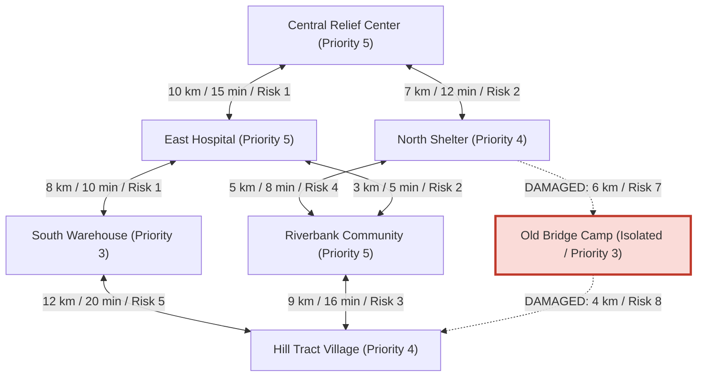

# 🚨 Disaster Relief Route and Supply Planning System (DRRSPS)

[](https://www.oracle.com/java/)
[](https://maven.apache.org/)
[](https://en.wikipedia.org/wiki/Algorithm)
[](LICENSE)

An algorithmic decision-support and route planning system implemented in Java. **DRRSPS** optimizes critical post-disaster humanitarian logistics, including damaged infrastructure isolation detection, multi-metric route optimization, and vehicle supply allocation under payload constraints.

---

## 📌 Table of Contents

- [Overview](#-overview)
- [Key Features](#-key-features)
- [System Architecture & Network Model](#-system-architecture--network-model)
- [Algorithmic Framework](#-algorithmic-framework)
- [Project Structure](#-project-structure)
- [Prerequisites & Requirements](#-prerequisites--requirements)
- [Getting Started](#-getting-started)
  - [Build the Project](#build-the-project)
  - [Execution Modes](#execution-modes)
- [CLI Menu Options](#-cli-menu-options)
- [Sample Run & Output](#-sample-run--output)
- [Performance & Benchmarks](#-performance--benchmarks)
- [Author & Acknowledgments](#-author--acknowledgments)

---

## 🌍 Overview

During natural disasters (e.g., floods, earthquakes, landslides), critical transportation networks are compromised, isolating affected populations while emergency supplies are scarce. 

**DRRSPS** addresses two fundamental disaster logistics challenges:
1. **Routing & Network Connectivity**: Identifies accessible routes between relief depots, hospitals, shelters, and isolated communities while automatically bypassing damaged roads based on distance, travel time, transit cost, or hazard risk.
2. **Supply Payload Optimization**: Maximizes the overall humanitarian benefit of loaded relief supplies (food, water, medicine, shelter kits) subject to transport payload weight limits using dynamic programming (0/1 Knapsack).

---

## ⚡ Key Features

- 🗺️ **Multi-Attribute Disaster Network**:
  - Models locations (relief centers, hospitals, shelters, camps, affected communities) with priority rankings.
  - Multi-weighted bidirectional roads supporting four dynamic evaluation metrics: `distance`, `time`, `cost`, and `risk`.
  - Real-time road damage tagging that immediately excludes hazardous or blocked segments.

- 🔍 **Graph Traversals & Connectivity Analysis**:
  - **Breadth-First Search (BFS)** for level-order reachability and connected component decomposition.
  - **Depth-First Search (DFS)** for alternative deep route exploration.
  - Isolated sub-network detection to pinpoint marooned clusters.

- 🛣️ **Multi-Metric Greedy Pathfinding**:
  - Generates fast step-by-step dispatch routes evaluated against chosen priorities (least hazard, fastest time, lowest cost, or shortest distance).

- 📦 **Optimal Supply Allocation (0/1 Knapsack)**:
  - Dynamic programming package selection maximizing relief utility ($\text{benefit} = \text{quantity} \times \text{priority score}$) within vehicle capacity limits.

- 📊 **Built-in Benchmarking & Self-Tests**:
  - Automated self-testing suite (`--self-test`) for algorithmic correctness.
  - Scalability performance benchmark (`--performance`) analyzing execution times across graph sizes ($N = 10 \to 100+$).

---

## 🏗️ System Architecture & Network Model



---

## 🧠 Algorithmic Framework

| Algorithm / Technique | Module | Time Complexity | Space Complexity | Practical Disaster Application |
| :--- | :--- | :--- | :--- | :--- |
| **Breadth-First Search (BFS)** | `ReliefNetwork.bfs()` & `bfsConnectivityGroups()` | $\mathcal{O}(V + E)$ | $\mathcal{O}(V)$ | Detects reachable safe zones and isolates inaccessible regions. |
| **Depth-First Search (DFS)** | `ReliefNetwork.dfs()` | $\mathcal{O}(V + E)$ | $\mathcal{O}(V)$ | Alternative exploration to find deep escape paths. |
| **Greedy Heuristic Routing** | `ReliefNetwork.greedyRoute()` | $\mathcal{O}(V \cdot d)$ | $\mathcal{O}(V)$ | Fast next-hop path selection optimized for distance, time, cost, or risk. |
| **0/1 Knapsack (Dynamic Programming)** | `allocatePackages()` | $\mathcal{O}(N \times W)$ | $\mathcal{O}(N \times W)$ | Maximize humanitarian relief score under transport payload limit. |

---

## 📁 Project Structure

```
DRRSPS/
├── pom.xml                               # Maven project configuration
├── nbactions.xml                         # NetBeans IDE runtime actions
├── src/
│   └── main/
│       └── java/
│           └── drrsps/
│               └── drrsps/
│                   └── DRRSPS.java       # Core application source code
└── README.md                             # Documentation
```

---

## 💻 Prerequisites & Requirements

- **Java Development Kit (JDK)**: JDK 17, 21, or 25+ installed and configured on your system path.
- **Maven** (Optional): Apache Maven 3.8+ (or run directly from IDE).
- **IDE** (Optional): NetBeans IDE, IntelliJ IDEA, Eclipse, or VS Code.

Verify your Java installation:
```bash
java -version
```

---

## 🚀 Getting Started

### 1. Clone the Repository
```bash
git clone https://github.com/your-username/DRRSPS.git
cd DRRSPS
```

### 2. Build the Project

#### Using Maven:
```bash
mvn clean compile
```

#### Using Standard JDK Compiler:
```bash
javac -d target/classes src/main/java/drrsps/drrsps/DRRSPS.java
```

---

## 🕹️ Execution Modes

The application supports multiple run modes via command-line flags or standard interactive menu execution:

### 1. Interactive Menu Mode (Default)
Run without flags to launch the interactive console CLI:
```bash
# Via Maven
mvn exec:java

# Via Java directly
java -cp target/classes drrsps.drrsps.DRRSPS
```

### 2. Automated Demo Mode (`--demo`)
Executes an end-to-end disaster scenario demonstration without requiring user input:
```bash
java -cp target/classes drrsps.drrsps.DRRSPS --demo
```

### 3. Automated Self-Test Mode (`--self-test`)
Runs unit verification checks for graph traversals, route checks, connectivity grouping, greedy pathing, and knapsack allocation:
```bash
java -cp target/classes drrsps.drrsps.DRRSPS --self-test
```
**Expected Output:**
```
PASS: route exists to Riverbank Community
PASS: damaged roads are ignored by BFS route check
PASS: BFS connectivity check finds two groups
PASS: greedy route reaches target by distance
PASS: 0/1 knapsack respects capacity
PASS: 0/1 knapsack sample benefit is correct

Self-test result: 6/6 checks passed.
```

### 4. Performance Benchmark Mode (`--performance`)
Profiles execution times (in milliseconds) across graph sizes of 10, 25, 50, and 100 nodes:
```bash
java -cp target/classes drrsps.drrsps.DRRSPS --performance
```

---

## 📋 CLI Menu Options

When launched in interactive mode, the following options are available:

```text
===========================================================
Disaster Relief Route and Supply Planning System (Java)
===========================================================
1. Show relief network
2. Check whether a route exists
3. Traverse reachable locations (BFS / DFS)
4. Analyze network connectivity using BFS
5. Find route using Greedy Algorithm (Distance / Time / Cost / Risk)
6. Allocate relief packages using 0/1 Knapsack
7. Run performance comparison
0. Exit
```

### Option Walkthrough:

- **Option 1 (Show Network)**: Displays all locations with priority scores and usable road counts, along with edge details.
- **Option 2 (Route Existence)**: Verifies whether an active traversal path exists between two locations through undamaged roads.
- **Option 3 (Traversal)**: Runs BFS or DFS from a starting hub to list all reachable nodes in visit order.
- **Option 4 (Network Connectivity)**: Groups locations into connected components, highlighting isolated disaster clusters.
- **Option 5 (Greedy Routing)**: Calculates optimal step-by-step route between two locations based on `distance`, `time`, `cost`, or `risk`.
- **Option 6 (Supply Allocation)**: Prompts for vehicle weight capacity (e.g., `45` kg) and outputs the mathematically optimal subset of packages to maximize relief benefit.
- **Option 7 (Performance Experiment)**: Executes micro-benchmarks comparing BFS, DFS, Greedy Route, and 0/1 Knapsack.

---

## 📦 Sample Supply Allocation Scenario

Given a transport vehicle with a maximum capacity of **45 units**:

| Package Item | Weight | Quantity | Priority Score | Benefit ($Q \times P$) | Selected? |
| :--- | :---: | :---: | :---: | :---: | :---: |
| Emergency Food Kits | 12 | 80 | 5 | 400 | ✅ Yes |
| Drinking Water Boxes | 18 | 120 | 5 | 600 | ✅ Yes |
| First Aid Packs | 6 | 40 | 4 | 160 | ✅ Yes |
| Sanitation Kits | 9 | 35 | 4 | 140 | ✅ Yes |
| Blankets | 10 | 60 | 3 | 180 | ❌ No |
| Temporary Shelter Tents | 25 | 20 | 5 | 100 | ❌ No |

**Optimization Results:**
- **Total Weight Loaded:** `45 / 45` (100% capacity utilized)
- **Total Humanitarian Benefit:** `1,300` score units
- **Unused Capacity:** `0`

---

## 📈 Performance & Benchmarks

Empirical runtime scaling across synthetic networks (tested on Java 25 Runtime):

```text
Nodes | Edges | BFS ms  | DFS ms  | Greedy ms | Knapsack ms
   10 |    19 | 0.0034  | 0.0029  |    0.0027 |      0.0168
   25 |    48 | 0.0046  | 0.0026  |    0.0003 |      0.0175
   50 |    99 | 0.0066  | 0.0090  |    0.0029 |      0.0411
  100 |   199 | 0.0147  | 0.0134  |    0.0002 |      0.0992
```

---

## 👤 Author

- **mdfuadanan** (ID: `251014032`)

---

## 📄 License

This project is licensed under the [MIT License](LICENSE) - open for educational and research use.
